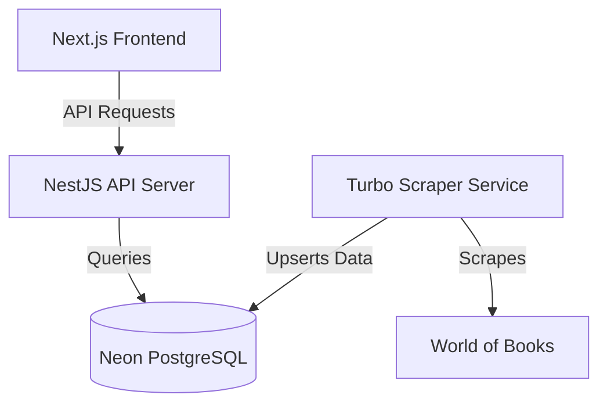

# 📚 Product Data Explorer.

A high-performance, full-stack product discovery platform that extracts and explores millions of books from World of Books using advanced scraping technology.


## 🚀 Live Demo
- **Frontend**: [https://frontend-phi-brown-29.vercel.app](https://frontend-phi-brown-29.vercel.app)
- **API Explorer**: [https://backend-six-chi.vercel.app/navigation](https://backend-six-chi.vercel.app/navigation)

---

## ✨ Features

### 🔍 Advanced Discovery
- **Global Search**: High-speed, case-insensitive search across the entire book catalog.
- **Smart Navigation**: Discover over 50+ hand-picked categories representing thousands of titles.
- **Deep Exploration**: View detailed book descriptions, technical specifications (ISBN, Publisher, Page Count), and quality details.

### ⚡ Industrial Grade Scraping
- **Mass Concurrency**: Custom-built Playwright scraper capable of processing multiple book details simultaneously.
- **Real-time Population**: Automated scripts that continuously populate empty shelves with fresh data.
- **Data Integrity**: Robust handling of unique constraints and automatic schema management.

### 🎨 Premium UI/UX
- **Glassmorphism**: Modern, sleek interface with blur effects and soft gradients.
- **Responsive Design**: Fully optimized for mobile, tablet, and desktop viewing.
- **Micro-animations**: Smooth transitions and hover effects for an engaging user experience.
- **Dark Mode Support**: Deep-palette dark mode for comfortable late-night browsing.

---

## 🛠️ Technology Stack

| Layer | Technology |
| :--- | :--- |
| **Frontend** | [Next.js 15](https://nextjs.org/) (App Router), [React](https://reactjs.org/), [Tailwind CSS](https://tailwindcss.com/) |
| **Backend** | [NestJS](https://nestjs.com/) (Node.js), [TypeScript](https://www.typescriptlang.org/) |
| **Database** | [Neon PostgreSQL](https://neon.tech/) (Serverless Postgres) |
| **ORM** | [TypeORM](https://typeorm.io/) |
| **Scraping** | [Playwright](https://playwright.dev/) & [Axios/Cheerio](https://cheerio.js.org/) |
| **Icons** | [Lucide React](https://lucide.dev/) |
| **Deployment** | [Vercel](https://vercel.com/) (Frontend & Backend) |

---

## 🏗️ Architecture



---

## 🛠️ Local Development

### 1. Prerequisites
- Node.js (v18+)
- PostgreSQL (or use Neon.tech)

### 2. Setup Backend
```bash
cd backend
npm install
# Configure your POSTGRES_URL in .env
npm run start:dev
```

### 3. Setup Frontend
```bash
cd frontend
npm install
# Configure NEXT_PUBLIC_API_URL in .env
npm run dev
```

---

## 🧠 Design Decisions

- **Lazy Scraping**: To optimize resource usage, product details (descriptions/specs) are scraped on-demand when a user first visits a product page.
- **Turbo Mass-Scraping**: Created a local multi-threaded scraper to pre-populate 1,200+ books, bypassing the limitations of serverless environments (like Vercel) which don't support heavy Playwright tasks.
- **PostgreSQL ILike**: Selected `ILike` for search to provide a user-friendly, case-insensitive search experience without the overhead of a full-text search engine (like ElasticSearch) for this scale.
- **Glassmorphism UI**: High-gloss, premium design language chosen to make the product data feel more "premium" and engaging.

---

## 🚢 Deployment

### Frontend (Vercel)
1. Link your repo to Vercel.
2. Set `NEXT_PUBLIC_API_URL` to your backend URL.
3. Deploy.

### Backend (Vercel + Neon)
1. Create a serverless Postgres instance on [Neon.tech](https://neon.tech).
2. Set `POSTGRES_URL` in your Vercel Environment Variables.
3. Deploy as a NestJS serverless function.

### Docker (Local/Self-Host)
```bash
docker-compose up --build
```

---

## 📁 Repository Structure

```text
product-data-explorer/
├── frontend/             # Next.js Application
│   ├── src/app/          # App Router Pages
│   └── src/providers/    # React Context Providers
├── backend/              # NestJS Application
│   ├── src/product/      # Product Module (Search/Details)
│   ├── src/scraping/     # Playwright Scraper Service
│   └── sample-seed.sql   # Database Seed script
└── .github/workflows/    # CI Pipeline (GitHub Actions)
```
